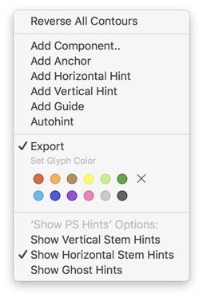

# Show PS Hints Also in Other Masters

Glyphs.app plug-in for displaying hints as set in the hint-origin master (which is usually the first master unless you use the custom parameter `Get Hints from Master` in *File > Font Info > Font*) also in masters other than the hint origin. The main idea is to find stem hint overlaps that could cause Hint Replacement, in case you seek to avoid Hint Replacement in certain circumstances. Thanks to Jeremy Tankard for the idea.

*View > Show PS Hints Also in Other Masters* also displays hints in the hint-origin master itself if *View > Show Hints* is turned off.

The plug-in also shows in the Preview area at the bottom of Edit view. Probably most useful is the *Show All Instances* setting, which lets you see the development of the hints:

In this example, the middle vertical stem grows larger across the instances and, starting at the second instance displayed, overlaps the vertical stem on the right.

### Installation

1. One-click install *Show PS Hints Also in Other Masters* from *Window > Plugin Manager.*
2. Restart Glyphs.

### Usage Instructions

1. Open at least one glyph in Edit View.
2. Use *View > Show PS Hints Also in Other Masters* to toggle the display of the hints.

You can set options via the context menu, and choose to display, e.g., only vertical stem hints:

### Requirements

The plug-in works in Glyphs 2.5.2 in High Sierra. I can only test it in current app and OS versions, and perhaps it works on earlier versions too.

### License

Copyright 2018 Rainer Erich Scheichelbauer (@mekkablue).
Based on sample code by Georg Seifert (@schriftgestalt) and Jan Gerner (@yanone).

Licensed under the Apache License, Version 2.0 (the "License");
you may not use this file except in compliance with the License.
You may obtain a copy of the License at

http://www.apache.org/licenses/LICENSE-2.0

See the License file included in this repository for further details.
