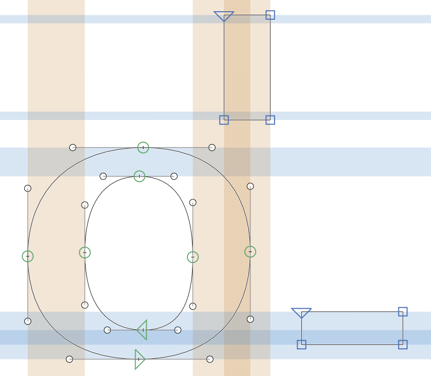

# Show PS Hints Also in Other Masters

Glyphs.app plug-in for displaying hints from the hint-origin master (which is usually the first master unless you set the custom parameter `Get Hints from Master` in *File > Font Info > Font*) also in other masters. The main idea is to find stem hint overlaps that could cause Hint Replacement. Thanks to Jeremy Tankard for the idea.

It also displays in the hints in the hint-origin master if *View > Show Hints* is turned off.

### Installation

1. One-click install *Show PS Hints Also in Other Masters* from *Window > Plugin Manager*
2. Restart Glyphs.

### Usage Instructions

1. Open at least one glyph in Edit View.
2. Use *View > Show PS Hints Also in Other Masters* to toggle the display of the hints.

### Requirements

The plug-in works in Glyphs 2.5.2 in High Sierra. I can only test it in current app and OS versions, and perhaps it works on earlier versions too.

### License

Copyright 2018 Rainer Erich Scheichelbauer (@mekkablue).
Based on sample code by Georg Seifert (@schriftgestalt) and Jan Gerner (@yanone).

Licensed under the Apache License, Version 2.0 (the "License");
you may not use this file except in compliance with the License.
You may obtain a copy of the License at

http://www.apache.org/licenses/LICENSE-2.0

See the License file included in this repository for further details.
